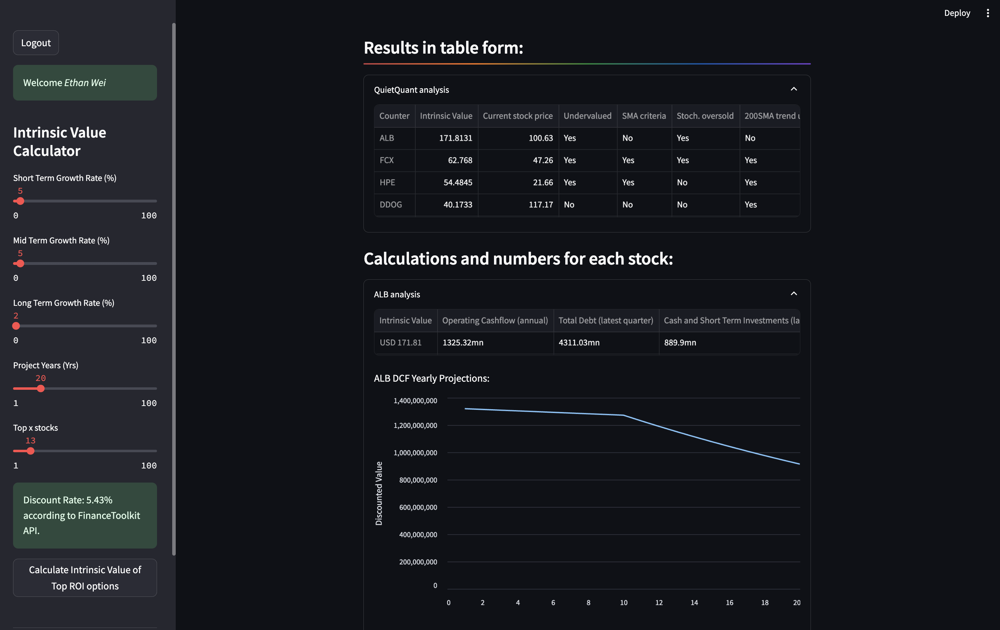
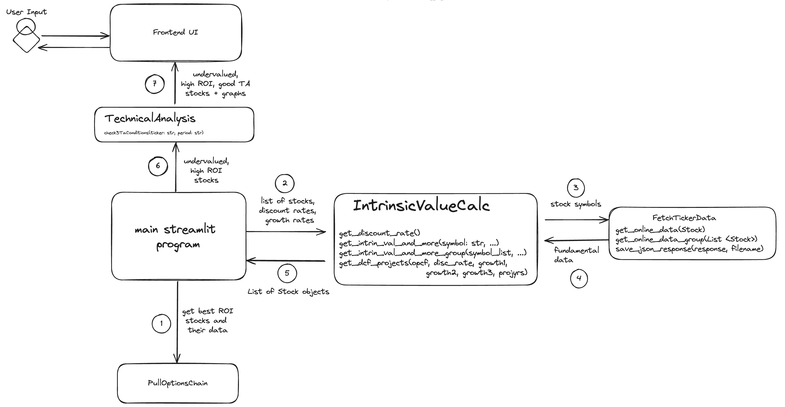
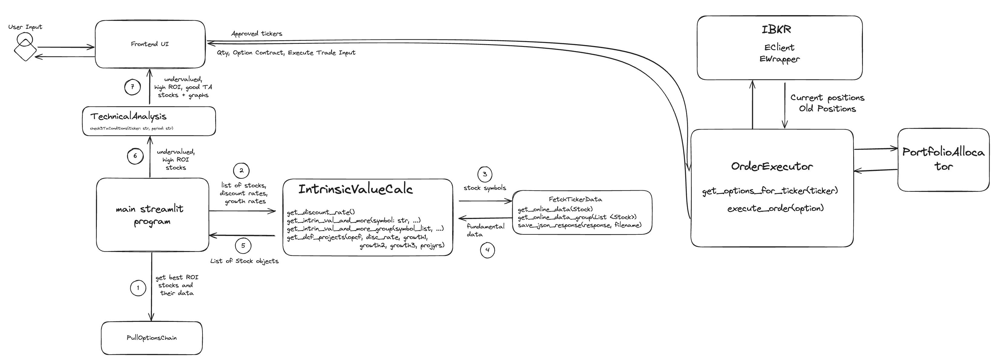
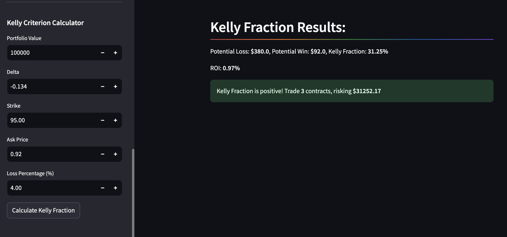
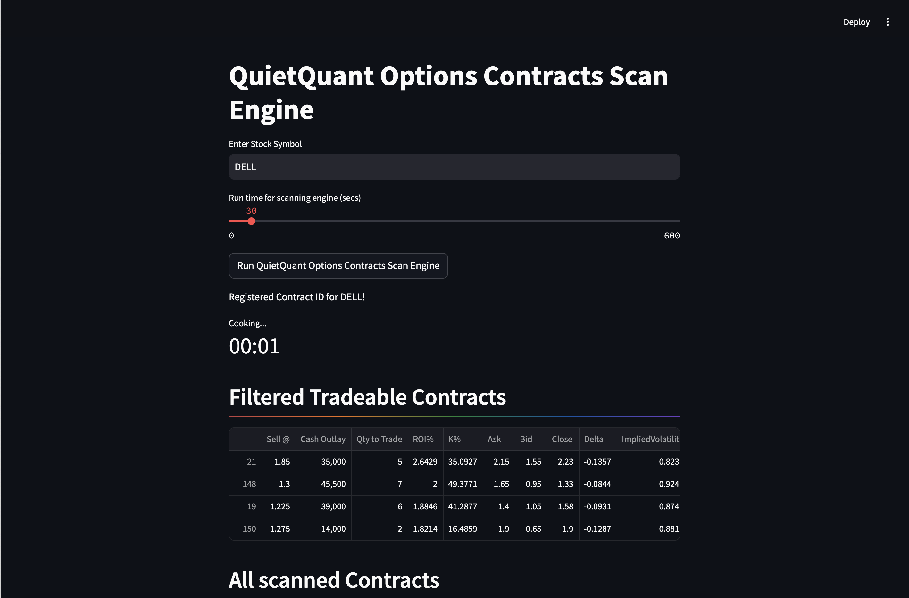
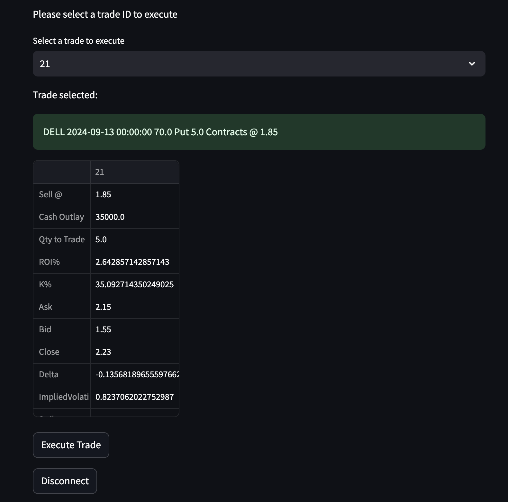
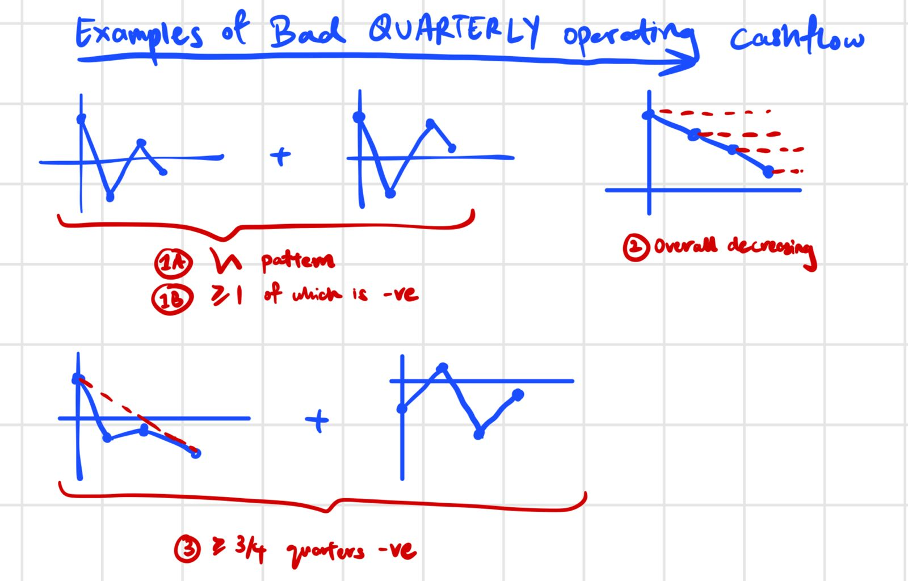

# QuietQuant

A S$30K funded project to develop an automated options trading program for two semi-retired engineers-turned-traders. The proprietary strategy generates an estimated 20% annually on a 7 figure portfolio. 

# Get started
1. Clone the repo
1. Install the requirements with `pip install -r requirements.txt`
1. Run `pip install ibapi` to install the Interactive Brokers API
1. Run the streamlit app with `streamlit run main.py`
1. Enjoy!

# Topics touched on in this project:
## Key Modules:
1. Fundamental Analyst
1. Technical Analyst
1. Sentiment Analyst
1. Intrinsic Valuation Analyst
1. Risk & Portfolio Manager
1. Options Contract Scanner Engine (OCSE)

## Software Development
### Tech Stack
1. Cloud Deployment
1. Shell Scripting
1. Python
1. Pandas for technical indicators
1. Streamlit
1. Selenium
1. IBKR API
1. FinanceToolkit
1. Yahoo Finance API
1. AlphaVantage API
1. RapidAPI
1. NewsAPI

## Programming Patterns
1. Guard Clauses
1. Error Handling
1. State Management
1. Logging
1. Typing
1. Locks (for writing to files)

### Data Structures and Algorithms
1. OOP
1. State Management
1. Web scraping
1. User Authentication
1. IBKR API usage (trade execution)
1. Automated trading

## Math/Finance
1. Options trading
1. Financial data analysis
1. Intrinsic value calculation
1. Discount rate calculation
1. Options trading strategies
1. Portfolio Optimization e.g. Efficient Frontier, Kelly Criterion
1. Black-Scholes model

# Architecture
## Phase 1: Gathering data, calculate intrinsic value of assets

## Phase 2: Gather top stock tickers from proprietary website ranked based on ROI of options. 

## Phase 3: Execute trades through IBKR that meet criteria for proprietary columns

## Phase 4: Use ML (NLP) to estimate 3-tier growth rates for companies
For this project, my original plan was to use [FinBERT](https://huggingface.co/ProsusAI/finbert), a pre-trained NLP model to analyze sentiment of financial text. It is built by further training the BERT language model in the finance domain, using a large financial corpus and thereby fine-tuning it for financial sentiment classification. 

I then switched to using GPT-4 with strict format restrictions for growth rate estimation with news articles.

## Phase 5: Kelly Criterion for portfolio optimization

## Phase 6: Options Contracts Scanner Engine (OCSE)

## Phase 7: Complete Automation of Research, Live Data Analysis, Trade Execution and Portfolio Management 
The phase is complete. 

Write up coming (22 Mar 2025 last edited)!

## Additional Features:
While some companies can have a good intrinsic value, their operational cashflow might tell a deeper story. This is a red flag for the company's future prospects, and hence, a penalty is applied to the stock's score, if such patterns are recognized! (Was interesting codifying these patterns)

# Data APIs
## NewsAPI.org use:
Limit 1000 requests per day
- docs link: https://newsapi.org/docs/get-started
- pricing link: https://newsapi.org/pricing

## FinanceToolkit (opensource)
(Starter Plan @ $305SGD/yr) Limit 300 requests per minute and uses FinancialModelingPrep under the hood (only US stocks)
- provider link: https://financialmodelingprep.com
- docs link: https://www.jeroenbouma.com/projects/financetoolkit/docs
- pypi link: https://pypi.org/project/financetoolkit/

## No longer using:
## Tiingo
Limit 1000 requests per day, max 50 per hour
- docs link: https://www.tiingo.com/documentation/fundamentals

## AlphaVantage API use:
Limit 25 requests per day
- docs link: https://www.alphavantage.co/documentation/

# Regularly used terminologies
| Term | Description |
| DTE | Days to Expiry | 

# Improvements and Optimizations:
- [X] Handled missing financial data case
- [X] Fail safe: Fetch financial data from 2 sources - Tiingo and Yahoo Finance to compare 3FS discrepency. (5% tolerance)
- [X] Automate finding of discount rate as well.
- [X] Add current stock price comparison
- [X] Error handling -> if data not available. Write error message as well.
- [X] State Management, saving time from making API calls repeatedly. ~60% speedup on load times.
- [X] Scrape Options data from online source 
- [X] Add and apply Technical Analysis module
- [X] Implement Kelly-Criterion for portfolio optimization
- [X] User authentication
- [X] AI sentiment analysis for growth rate estimation
- [X] Pull Options Chain from IBKR API
- [X] Score system for top options to trade
- [X] Efficient finding of household name stocks against list of undervalued stocks.
- [X] Sort, Rank and calculate Kelly and no. of contracts to trade on Options Chain from IBKR API
- [X] Execute trades through IBKR API
- [ ] How often does the intrinsic value change? How often should we re-calculate it? -> Can store the intrinsic value in a database and update it every 3 months.
- [ ] Concurrent fetching of data
- [ ] Average growth rates for 3-tier growth rate estimation
- [ ] Google Authenticaiton
- [ ] Bot checks all possible before deciding which ones to go for based on available portfolio. and best options ranked out of all those, considering buying power use. 
- [ ] Bot make sure its not bank
- [ ] Shift forexrate API 

# Requested features (Active Log to be changed and cleared)
- [X] Use yahoofinance for additional FS data to obtain an average, more accurate intrinsic value.
- [X] Cashflow to use TTM
- [X] Add 1 point for household name
- [X] View stock's sector
- [X] Improve trade selection on options contract scanner engine (OCSE)
- [X] Improve SMA criterias to be 50, 150, 200
- [X] change to default include ticker sources, not exclude.
- [X] Get tickers from list curated by human.
- [X] qq: Need to shift the data set of train features up by one, so we can use the previous quarter’s data to predict the upcoming cashflow growth of the next quarterwith 
- [ ] Use yfinance's cache function to speed up data fetching
- [ ] More accurate growth rate prediction: If bad quarterly OCF recently, then 0.0 ST, MT growth. Else we calculate average annual growth rate of past 3 years, if no past 3 years, then 1% growth rate. Long term by default is 3% (GDP).
- [ ] Do sth related to getting more stocks?
- [ ] Leave sources unfilitered for shorting as well?
- [ ] Avoiding shorting stocks w shortterm uptrend breakout. -> Mean that there're believers that stock will turn around soon.
- [ ] scrape https://marketchameleon.com/volReports/VolatilityRankings as optionsellerroi replacement.
- [ ] qq: look at a company’s war chest as well
- [ ] Make time series stationary by: 1. Differencing 2. Seasonal differencing 3. Variance stabilizing transformation
- [ ] Use Market Scanner for stock universe scoping. 
- [ ] Build Portfolio Management System -> Checking available cash, buying power, before deciding how many contracts to trade.
- [ ] Build IBKR's Scanner for coveted stocks

# Change log:
22 Mar 2025:
1. Improve IBKR connector, add error handling, and test code

12 Mar 2025:
1. Improve reliability by using manual growth rate if API fails

14 Feb 2025:
1. Improve Email Messaging

6 Feb 2025:
1. Fix issue of needed options contract not found - Found that reason was due to Strike being too low such that it doesn't exist, although it originated from a defined IBKR API call back, _securityDefinitionOptionParameter_
1. Add criteria for returned options to be within a certain price range, as a percentage of the current stock price so we have realistic, tradeable contracts.

2 Feb 2025:
1. Clean OCSE

27 Jan 2025:
1. Improve Automaton, Add Gmail, Improve Code Quality, Add concurrency

26 Jan 2025:
1. Clean code, Add Automaton

25 Jan 2025:
1. Fix bugs that were caused by a change in the API response format, yahoo finance.

28 Aug 2024:
1. Increase weight penalization for companies with bad patterns.

20 Aug 2024:
1. Update greek parameter values
1. change to default include ticker sources, not exclude.
1. Get tickers from list curated manually

13 Aug 2024:
1. Improve trade selection on options contract scanner engine (OCSE)

9 Aug 2024:
1. Added check for adverse operational cashflow patterns

8 Aug 2024:
1. Codifying Bad quarterly operational cashflow where it penalizes the score of a stock.

7 Aug 2024:
1. Minor bug fixes where price data was returning None when yahoo data fails to download

4 Aug 2024:
1. Added Stock undervalued calculation, supporting a new neutral-bearish strategy.
1. Stocks sorted by Score

3 Aug 2024:
1. Add trade selection option

Late Jul - Aug 2024:
1. Building Options Scanning Engine -> Pulling Options Chain from IBKR API
2. Filter and sort tradeable options
3. Calculate cashoutlay, kelly %, ROI for tradeable options

17 Jul 2024:
1. Added company sector to the table of results.
1. Added business summary for each company.
1. Bug fix for Yahoo Finance reporting in different currency.

13 Jul 2024:
1. Improved data pulling and calculation clarity with secondary data source. 
1. Added Go to Stock's Yahoo Finance page link.

12 Jul 2024:
1. Usage of TTM Operational Cashflow instead of the last year's data for Intrinsic Value calculation.
1. Draws financial data from yahoo finance as a comparison to FinancialModelingPrep.

7 Jul 2024:
1. Enable single ticker lookup with FinancialModellingPrep. Was previously using AlphaVantage.
1. Option to disable technical analysis checks.
1. Range selection of top X to top Y stocks.

5 Jul 2024:
1. Implemented Back up discount rate provider should financetoolkit fail.

3 Jul 2024:
1. Fixed bugs in individual intrinsic value calculation
1. Used paid API key!
1. Default Kelly's loss amount to 2.5%. 

30 Jun 2024:
1. Ensure varying currencies used in FS reporting is accounted for in calculating Intrinsic Value.

23 Jun 2024:
1. State Management, saving time from making API calls repeatedly. ~60% speedup on load times.
1. Implemented Kelly Criterion for user.
1. General UI improvements, making sliders into number inputs instead.

18 Jun 2024: 
1. Improve Kelly Criterion calculation by agreeing on a standard way to decide how to determine "loss" amount.
1. Add points system to list of top stocks to trade
1. Pull options chain from IBKR
1. Move to Fly.io

14 Jun 2024:
1. Implemented latest news API for growth rate estimation for individual stock analysis.
1. Used gpt-4o with strict format restrictions for growth rate estimation with news articles. 
1. Integrate TWs
1. Calculate Kelly Criterion

10 Jun 2024:
1. Improved sortable tables and information organisation (UI updates)

6 Jun 2024:
1. User Authentication
1. Bug fixes

4 Jun 2024:
1. Proper API Key handling using .env file
1. Filter for only undervalued stocks
1. Changed URL to pull best ROI per day instead.
1. Added Technical Analysis module for the 3 checks
1. Added the 3 check results to table of results
1. Display price, SMAs and stochastic oscillator values in the table

29 May 2024:
1. Webscrape with selenium from a website for highest ROI options.
1. Run intrinsic value calculation on this basket of stocks
1. Error handling of missing values from financial reports

23 May 2024:
1. Added auto pulling of discount rate.   

22 May 2024:
1. Fixed to Annual report data for Cashflow
1. Changed API provider with a higher API limit (AlphaVantage to Tiingo, from 25 req/day to 1000 req/day free)
1. Changed away from Tiingo after realising that their fundamental data is free only for DOW30 stocks. Trying Yahoo finance via Rapid API
1. Changed to FinanceToolkit 2024: an open source toolkit gathering financial data with transparent methods of calculations.
1. Use YahooFinance API through RapidAPI to get current stock price

# Archive
## Public Financial data sources
1. financialmodelingprep.com 
1. https://github.com/JerBouma/FinanceToolkit
1. https://www.alphavantage.co/documentation/
1. https://www.tiingo.com/documentation/fundamentals
1. https://rapidapi.com/apidojo/api/yahoo-finance1

# Dev Notes
### Creating requirements.txt with pipreqs: 
`$pipreqs . --encoding=iso-8859-1 --ignore optionstrader/ --force`

### After deploying to Fly, to install chrome driver to support selenium
fly ssh console -s -a app-name
apt-get update
apt-get install -y wget gnupg
wget -q -O - https://dl.google.com/linux/linux_signing_key.pub | apt-key add -
sh -c 'echo "deb [arch=amd64] http://dl.google.com/linux/chrome/deb/ stable main" > /etc/apt/sources.list.d/google-chrome.list'
apt-get update
apt-get install -y google-chrome-stable

### Killing python process blocking new IBKR client connection:
ps -ef|grep python
kill -9 <pid>

